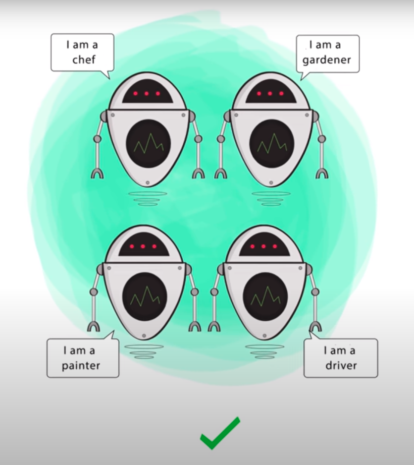
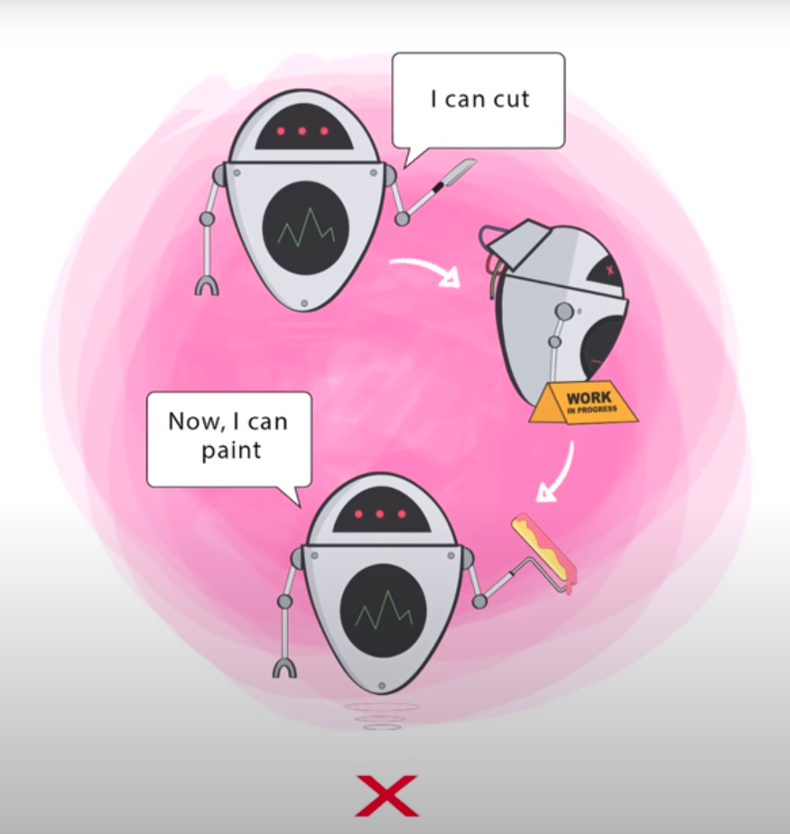
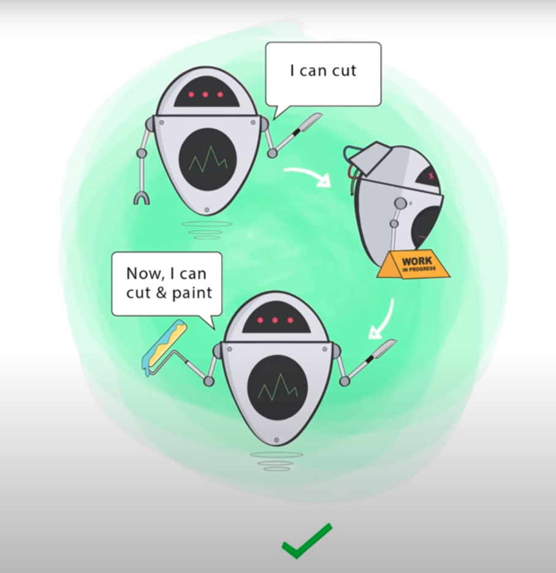

## SOLID

### :beginner: S ⇒ Single Responsibility Principle

Esse princípio determina que cada classe, cada arquivo dentro da nossa aplicação deve ter apenas uma única responsabilidade, ou seja, aquele arquivo deve ser responsável por executar apenas uma única tarefa dentro da nossa aplicação. Você dentro da sua vida como programador já deve ter deparado com alguns controllers que tem vários métodos lá dentro, várias funcionalidades, fazendo criação, atualização, remoção, listagem, e dentro de cada um desses tem vários IF e vai para um lado e vai para outro, e você quer colocar mais métodos dentro do controller, ou seja, aí já é um grande ponto que a gente tem que falar que esse controller tem responsabilidades demais. </br>

<h2 align="center">
  
  
</h2>

**Entidades independentes e isoladas é possível:**
- reaproveitar o código mais facilmente;
- refatorar mais facilmente;
- fazer testes automatizados mais facilmente;
- gerar menos bugs. E mesmo que gere bugs vai ser mais fácil de isolar e concertar onde está o problema;
- facilita a manutenção.

**Dica para separar melhor as responsabilidades:** tentar colocar no nome da função ou do componente tudo que ele está fazendo. Se você estiver tendo dificuldades é sinal que sua função está tendo várias responsabilidades, visto que ficou uma coisa bisonha do tipo:
```bash
function registrationAndEmailConfirmationAndAuthentication() {...}
```

### :beginner: O ⇒ Open Closed Principle

Esse princípio defini que uma classe deve ser aberta para extensões, mas não deve ser aberta para modificações, ou seja, quando a gente vai estender uma classe, a gente vai reaproveitar todo funcionamento que ela já tem e nós não vamos sobrescrever funcionamento daquela classe, nós não vamos criar uma nova classe substituindo funcionamentos, a gente vai estender aquela classe e reaproveitar o funcionamento que ela já tem substituindo apenas alguns pontos que a gente acha interessante, mas a gente nunca vai estender uma classe e modificá-la por completo.

<h2 align="center">
  
  
</h2>

**Exemplo:** Para cada novo tipo de pagamento que entrar, como por exemplo pagar com pontos de fidelidade, vai ter que não somente ter que implementar ele, mas também implementar as modificações na função de processa pagamentos. E daí sua regra de negócio
começa a manchar os outros componentes:
```bash
function processaPagamentos(objeto) 
	if (objeto.tipo == 'boleto') {
		objeto.codigoDeBarras...
	} else if (objeto.tipo == 'credito' || objeto.tipo == 'debito') {
		objeto.numero...
		objeto.vencimento...
		objeto.nome...
		objeto.antifraude...
	} else if (objeto.tipo == 'cartaoFidelidade') {
    ...
  } else if (objeto.tipo == 'milhas') {
    ...
  }
	objeto.cobrar()...
```

Para resolver isso é preciso de um nível de abstração correto. A abstração de processa pagamentos acima não deveria saber os campos específicos de cada produto financeiro para validar ou uma condicional que deveria consultar uma fraude ou não. No limite ela deveria receber um objeto de pagamento, uma instrução, e pedir para esse objeto se validar, depois se cobrar, e essa abstração decide especificamente o que vai ser feito depois desse objeto que foi ejetado retornar sucesso ou não para cada etapa.

```bash
function processaPagamentos(intrumento) 
	instrumento.valido...
	instrumento.cobrar...
```

Se todos os objetos que você jogar lá para dentro respeitarem essa mesma interface, você nunca mais vai precisar modificar a classe base de processamento quando for adicionado novos métodos de pagamento.

### :beginner: L ⇒ Liskov Substitution Principle

Esse princípio defende que a gente pode substituir implementações que uma classe depende. Por exemplo: imagina que a gente tenha um controller / classe que faz upload de arquivos. E a gente tem vários drivers diferentes para upload de arquivos. Nós podemos fazer upload de arquivos para nosso próprio servidor ou fazer para um CDN por uma Amazon S3, por um Google Cloud Storage, e etc. O Liskov substitution principle defende que nós podemos pegar simplesmente esses drives de upload (Amazon S3, Google Cloud Storage, e etc) e substituir eles, trocar entre eles dentro dessa classe que faz o upload de maneira geral e ela vai continuar funcionando sem problemas nenhum, ou seja, substituir a implementação da funcionalidade de upload sem danificar todo o restante que é a regra de negócio, a lógica que existe dentro de um upload, por exemplo a própria validação, qualquer coisa assim.</br>

### :beginner: I ⇒ Interface segregation Principle

Esse princípio defende basicamente que você não crie interfaces que são muito robustas com várias propriedades, e sim dividas essas interfaces em interfaces menores, em tipagens menores. Várias interfaces somadas que definiriam o objeto como um todo, com todas as propriedades que ele precisa. Exemplo: jogador, jogador de futebol, atacante, goleiro...

### :beginner: D ⇒ Dependency Inversion Principle

Esse princípio anda muito próximo com o Liskov substitution principle. O Dependency inversion principle defende que as classes da nossa aplicação, as classes que realizam as ações, os useCases, os controllers ou qualquer coisa assim, elas não devem depender de implementações. Elas devem depender geralmente de interfaces que são formas não funcionais da gente de mostrar qual vai ser a tipagem de uma classe. Imagina que a gente tenha um arquivo responsável por fazer upload de imagens. A classe de upload de imagens não deve saber onde que a imagem deve ser armazenada, ela deve ter a responsabilidade apenas de mostrar qual é o fluxo de upload de imagens, ela não deve saber exatamente onde que a imagem vai ser guardada. Então é isso que faz o Dependency inversion principle, a gente coloca essa dependência, esse driver de onde vai ser armazenado a imagem, a gente passa como dependência para essa classe de upload de imagem, mas ela não sabe exatamente qual que é o lugar final onde essa imagem vai cair. Na verdade ela apenas sabe que naquele driver tem aqueles métodos, método de upload, método delete por exemplo, mas ele não sabe o que o método faz, e se um dia eu trocar um pelo o outro, aplicando o Liskov substitution principle vai dar tudo certo, vai continuar funcionando desde que respeite a interface principal, desde que respeite o que eu tenho que passar, o que eu tenho que retornar e por aí vai.